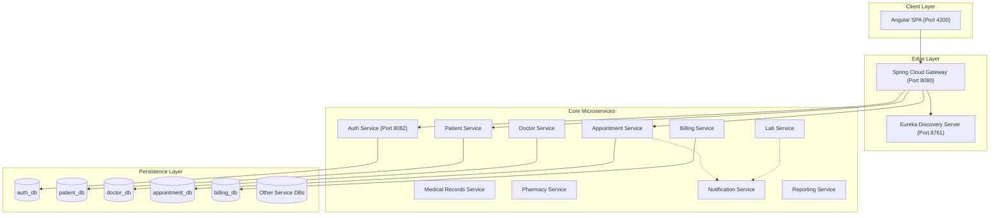
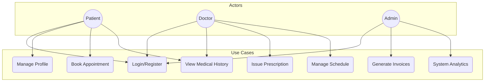
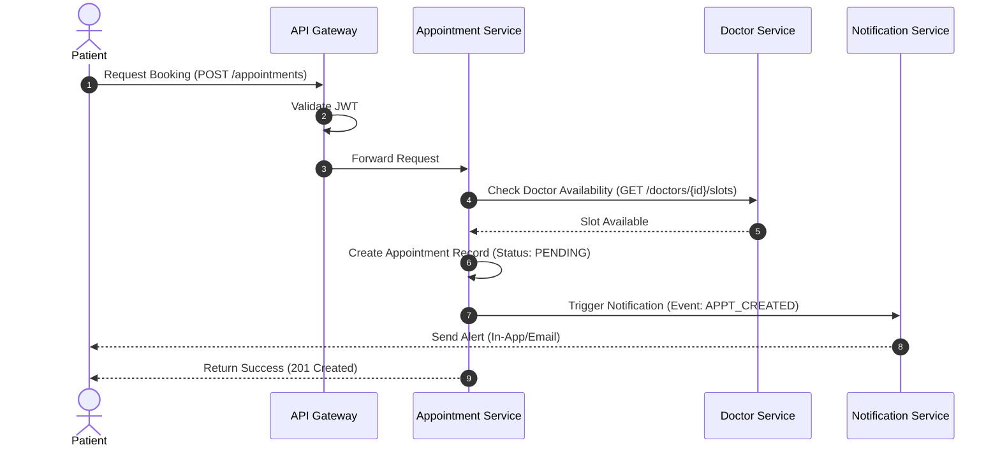
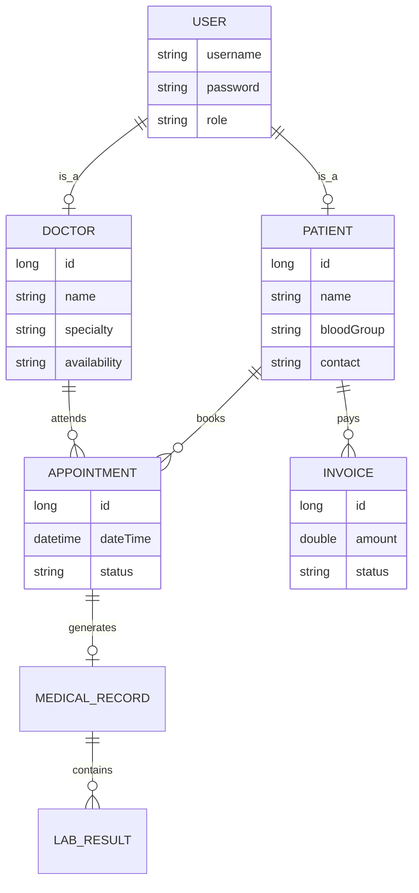

# HMS Project Diagrams and ChatGPT Prompts

This document provides a comprehensive overview of the **Healthcare Management System (HMS)** architecture, use cases, flows, and entities. You can use these descriptions and Mermaid diagrams as prompts for ChatGPT or other AI tools to generate more detailed documentation or code.

---

## 1. System Architecture Diagram

The HMS follows a **Microservices Architecture** pattern, using Spring Cloud for service orchestration and Angular for the frontend.

### Mermaid Diagram

### Dependency & Flow Description
- **Frontend**: Communicates solely with the **API Gateway**.
- **API Gateway**: Handles routing and **JWT Validation**. It fetches service locations from the **Discovery Server (Eureka)**.
- **Inter-service Communication**: Services use **Feign Clients** or **RestTemplate** for synchronous calls (e.g., Appointment service checking if a Patient exists).
- **Persistence**: Each microservice has its own isolated **MySQL Database**, ensuring loose coupling.

---

## 2. Use Case Diagram

Defines the interactions between users (Actors) and the system.

### Mermaid Diagram

### Flow Description
- **Patients**: Can manage their profile, book appointments with specific doctors, and view their clinical history.
- **Doctors**: Manage their own availability slots, view patient records during consultations, and issue electronic prescriptions.
- **Admins**: Monitor system health, manage billing cycles, and view hospital-wide performance reports.

---

## 3. Sequence Diagram (Appointment Booking)

Illustrates the step-by-step logic for booking an appointment.

### Mermaid Diagram

### Dependency & Flow Description
1. **Security**: The Gateway ensures the user is authenticated.
2. **Validation**: The Appointment service performs cross-service validation (checking Doctor schedules).
3. **Eventual Consistency**: Notifications are often triggered asynchronously after the main record is saved.

---

## 4. Entity Relationship Diagram (ERD)

Shows the data structure of the core domain entities.

### Mermaid Diagram

### Data Flow Description
- **Normalization**: Data is split across service boundaries. For example, the `Appointment` table stores `patientId` and `doctorId` as foreign keys referencing entities in other microservices.
- **Auth Linkage**: Every `Patient` and `Doctor` record maps back to a `User` entity in the `auth-service` via a unique identifier.

---

## 🤖 ChatGPT Prompt for Documentation Generation

*Copy and paste the following prompt into ChatGPT to get detailed documentation:*

> "I am working on a Healthcare Management System (HMS) built with Spring Boot microservices and Angular. Please help me generate detailed technical documentation for the following diagrams I have:
> 
> 1. **Architecture**: Microservices (Auth, Patient, Doctor, Appointment, Billing, Lab, records, Pharmacy, Notification, Reporting) connected via a Spring Cloud API Gateway and Eureka Discovery Server. Each has its own MySQL database.
> 2. **Use Case**: Actors include Patients (booking, history), Doctors (prescribing, schedules), and Admins (billing, reports).
> 3. **Sequence**: A booking flow where the Appointment service calls the Doctor service to verify slots and then triggers the Notification service.
> 4. **Entities**: Core entities are User (Auth), Patient, Doctor, Appointment, Invoice, and MedicalRecord.
> 
> Please provide:
> - A detailed 'System Overview' section.
> - A 'Component Interaction' guide explaining how the services talk to each other.
> - A 'Database Schema' description focusing on how microservice data isolation is handled.
> - A 'Security Flow' description for JWT-based authentication at the Gateway."

---

## 🤖 ChatGPT Prompt for Code Refinement

> "Based on a microservices HMS architecture (Spring Boot) with an API Gateway and individual MySQL DBs, write a Java Spring Boot Controller and Service implementation for a 'Billing Service'. 
> - It should have endpoints to create an invoice, get all invoices for a patient, and update payment status.
> - It should use a Feign Client to get Patient details from the 'Patient Service'.
> - Include basic JPA Entity mapping for an 'Invoice' class with fields: id, patientId, amount, date, status (PAID/UNPAID)."

